Dokumentace k praktickému úkolu: Správa Linuxového Serveru
Student: Jan Bergmann 
Datum: 6. dubna 2026 
OS Serveru: Fedora 43 
OS Klienta: Windows 11

1. Konfigurace virtuálního prostředí (VMware)
Prvním krokem byla příprava virtualizovaného hardwaru a síťové infrastruktury, aby odpovídala požadavkům na izolovanou podnikovou síť.
Hardware a Síť
•	Disky: Systémový disk (20 GB) a dva datové SATA disky (2x 10 GB).
•	Síťový adaptér: Nastaven na VMnet8 (NAT) s vlastní definovanou podsítí.
•	Subnet: 172.16.0.0 s maskou 255.255.0.0 (/16).
 
 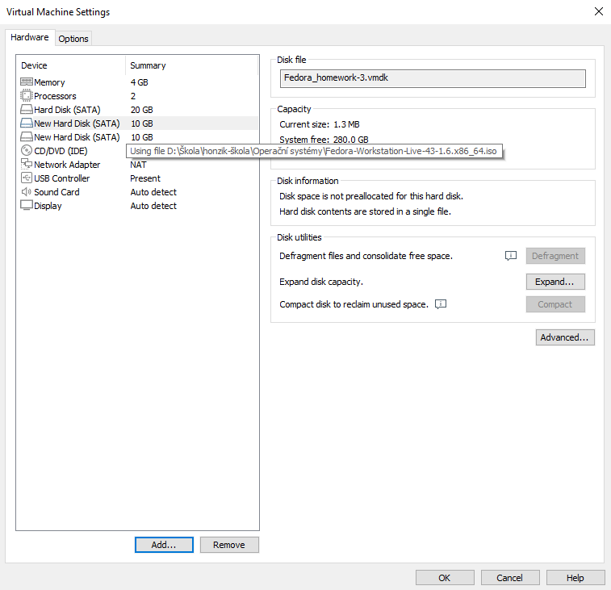
 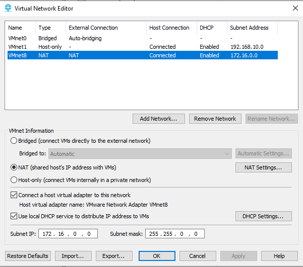
 
2. Správa úložného prostoru (LVM)
Pro efektivní správu dat byl vytvořen logický celek (LVM), který spojuje oba 10GB SATA disky do jednoho svazku o velikosti 20 GB.
Realizace:
•	Vytvořena skupina svazků data_vg.
•	Vytvořen logický svazek share_lv připojený do adresáře /srv/share.
•	Souborový systém: ext4.
 
  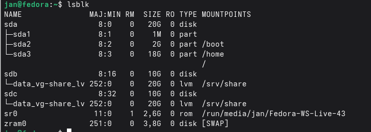

3. Síťové služby a Webový server
Server plní roli webového hostingu se dvěma instancemi a souborového serveru (Samba).
Konfigurace Apache (httpd):
•	Server je plně funkční a naslouchá na portech 8080 a 8081.
•	Služba je nastavena na automatický start.

 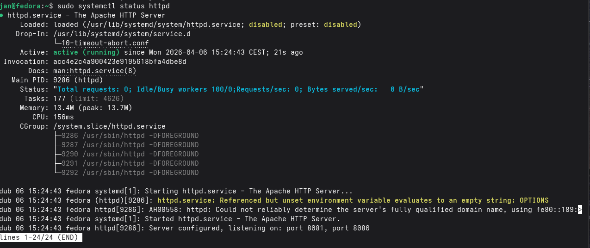

4. Zabezpečení a Firewall
Bezpečnost je zajištěna pomocí nástroje UFW, který implementuje politiku „vše zakázáno, kromě výjimek“.
Povolené služby:
•	SSH (22): Vzdálená správa.
•	HTTP (8080, 8081): Webové služby.
•	Cockpit (9090): Webová administrace.
•	Samba (445): Sdílení souborů.
•	VNC (5900): Vzdálená plocha.

 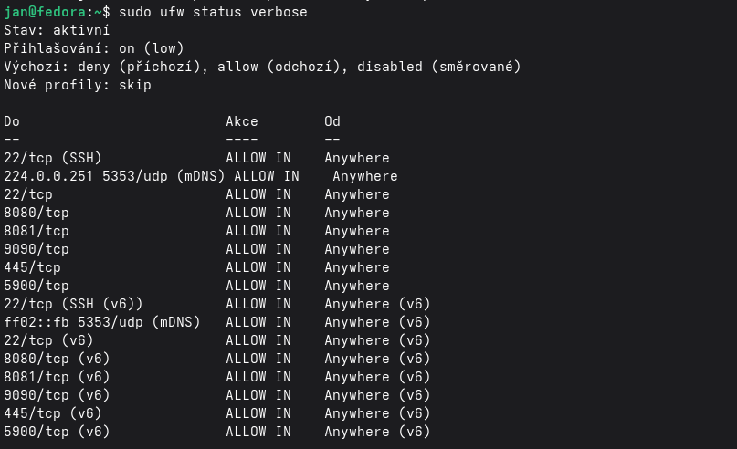
 
5. Síťová konfigurace (Statická IP)
Pro zajištění dostupnosti serveru v rámci sítě byla nastavena statická IP adresa na konci adresního rozsahu.
•	IP adresa: 172.16.255.254/16
•	Rozhraní: ens160
 
 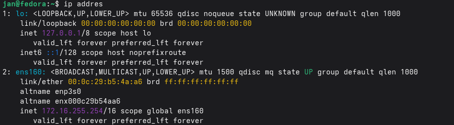
 
6. Automatizace a údržba (Zálohovací skript)
Pro zajištění kontinuity provozu a ochranu uživatelských dat byl vytvořen vlastní Bash skript, který provádí pravidelnou archivaci sdíleného adresáře.
Technické řešení:
•	Zdroj: /srv/share (LVM svazek).
•	Cíl: /home/jan/zalohy (systémový disk).
•	Metoda: Komprese tar -czf s dynamickým pojmenováním souboru podle aktuálního data.
•	Práva: Skriptu byla přidělena práva pro spuštění (chmod +x).
 
 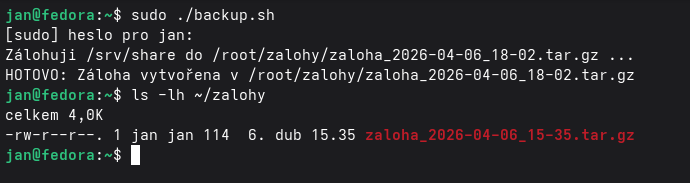
 
7. Správcovská stanice (Windows 11) a správa hesel
Jako klientské rozhraní pro správu serveru byl zvolen systém Windows 11 Pro, běžící na virtuálním hardwaru typu NVMe, což zajišťuje vysokou odezvu správcovských nástrojů.
Bezpečné ukládání údajů (KeePassXC):
V souladu s bezpečnostními standardy byla na stanici nainstalována aplikace KeePassXC. V ní je vytvořena šifrovaná databáze, která obsahuje:
•	Přihlašovací údaje pro SSH přístup k serveru.
•	Autentizační údaje pro síťové sdílení Samba.
 
 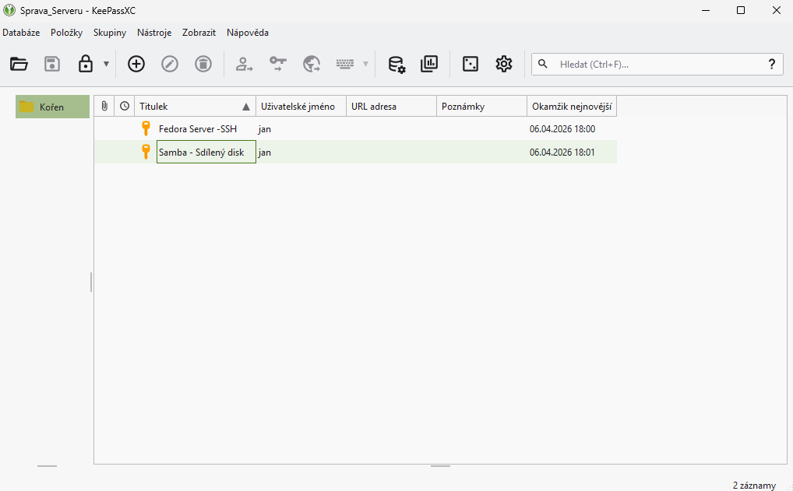
 
8. Vzdálený přístup a SSH klíče
Byl implementován moderní způsob autentizace pomocí RSA klíčů, který eliminuje potřebu zadávání hesla při každém přihlášení a zvyšuje odolnost proti Brute-force útokům.
Implementace:
1.	Vygenerování páru klíčů na stanici Windows 11 (ssh-keygen).
2.	Export veřejného klíče na server Fedora do souboru authorized_keys.
3.	Ověření automatického přihlášení bez výzvy k zadání hesla.

    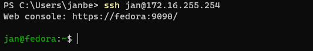
 
9. Ověření síťových služeb z klienta
Závěrečná fáze testování potvrdila správnou konfiguraci všech serverových služeb.
A. Webový hosting (Porty 8080/8081):
V prohlížeči Edge byly úspěšně načteny testovací stránky z obou nakonfigurovaných instancí webového serveru.

 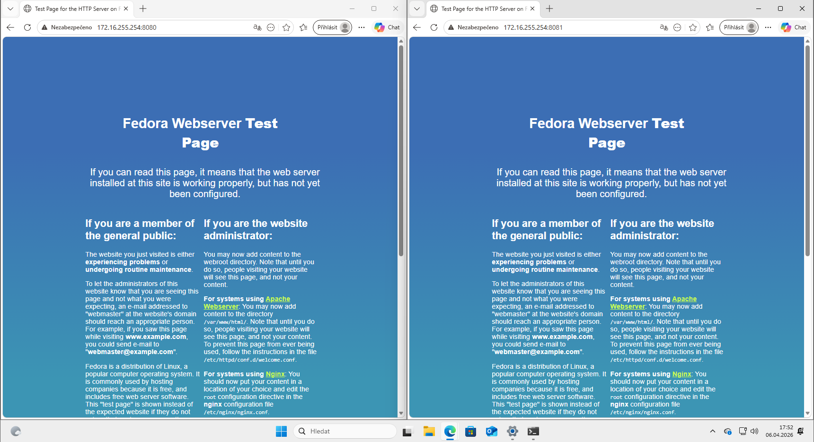
 
 
B. Síťové úložiště (Samba):
Sdílený adresář byl úspěšně namapován jako síťová jednotka. Kapacita disku odpovídá 20 GB logickému svazku LVM.

 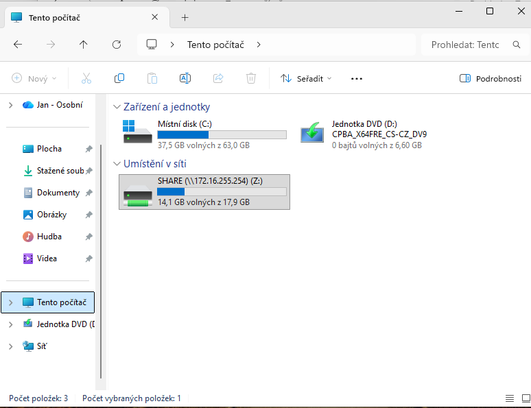
 
 
C. Webová správa (Cockpit):
Vzdálený monitoring serveru probíhá přes rozhraní Cockpit na portu 9090.

  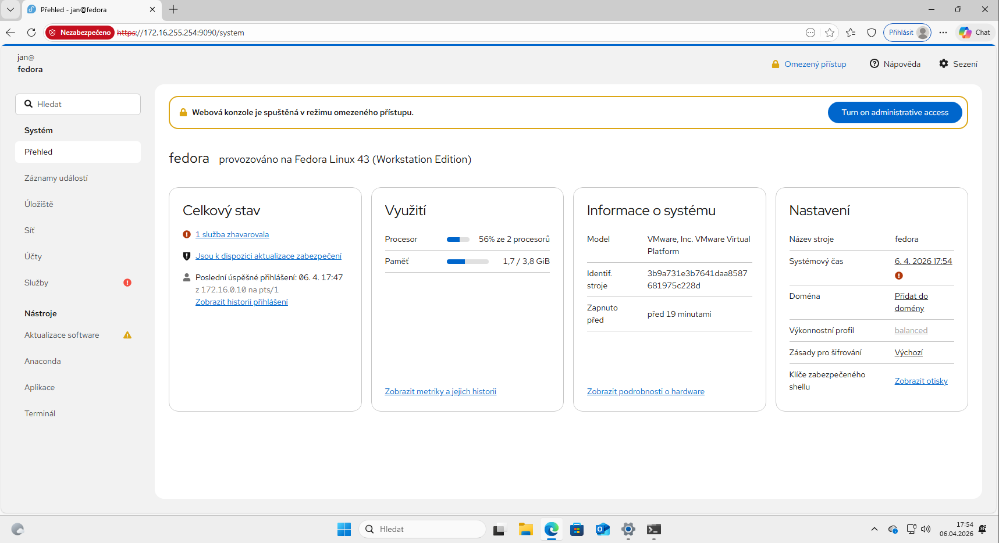
